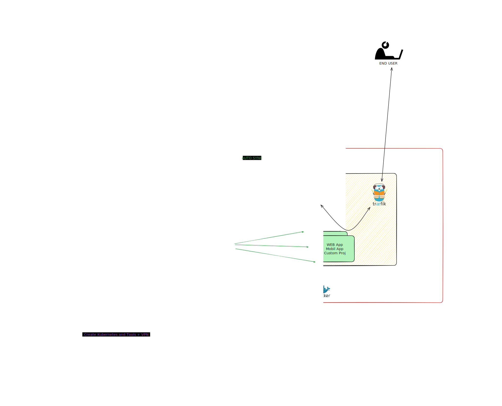

# Getting started with Ansible

## To Be Modified for our servers

This repository contains code that was worked on during the creating prod evironment. With this repo we created Kubernetes and all services.   

For more information you can check [DOCUMENTATION](./ansible.md).  

## Steps

1. - [x] Create 3 EC2 VM
1. - [x] Do the Load Balancing and port openning
1. - [x] login servers and add ansible ssh key for all
1. - [x] Ansible Steps
   1. - [x] Create/Update Inventory
   1. - [x] Update Servers
   1. - [x] Install Docker
   1. - [x] Deploy [wirehole](https://github.com/IAmStoxe/wirehole) - [Helper Video](https://www.youtube.com/watch?v=DOJ39lyx6Js)
      1. - [x] Create VPN files
      1. - [x] Test the vpn connection
      1. - [x] Try connect all servers via vpn
   1. - [x] Install Kubernetes 
      1. - [x] Master
      1. - [x] Workers
   1. - [x] Test Kubernets
   1. - [x] Do the netwotkig
   1. - [x] Install MetalLB
   2. - [x] UFW - Firewall settings
   3. - [x] Create NFS Provisioning
   4. - [x] Install ArgoCD
       1. - [x] with bash/ansible do the settings - git connections
       2. - [x] Update/Deploy Everything with ArgoCD
       3. - [x] Make sure to deploy these
           1. - [x] Database --> Related with NFS don't loose any data
           2. - [x] [Drone CI](https://www.drone.io/) OR Jenkins to manage the deploymentes
   5. - [x] Install Traefik - using certs from CertManager
   6. - [x] Install CertManager - needed domain name

__*Note*__ : Create Documentation on every step! Don't leave it to the tomorrow. And Create Diagrams. 

